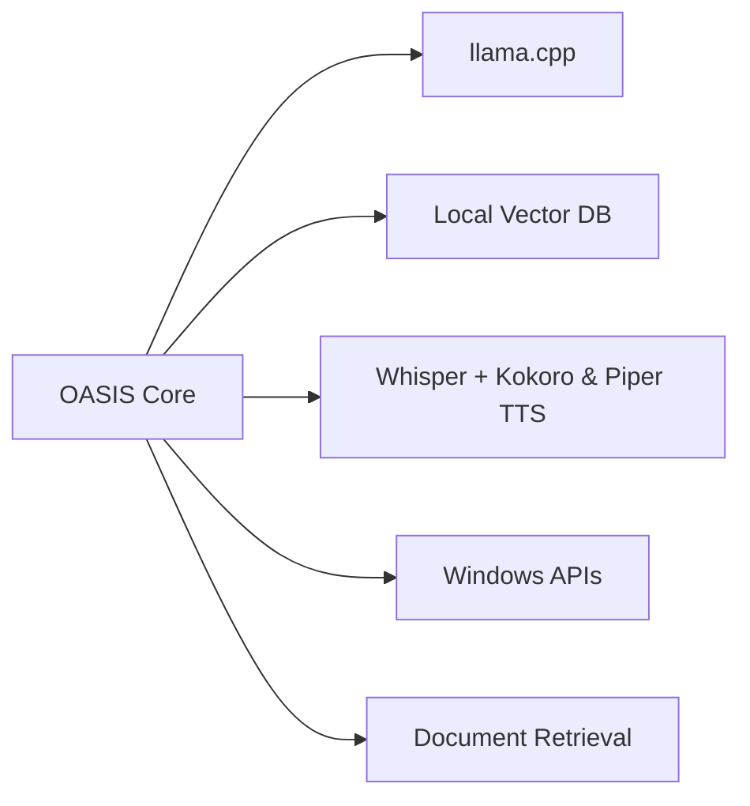

<div align="center">


<br>

# O.A.S.I.S.

### Operative Autonomous System for Intelligent Services

**Your AI assistant. Your PC. Your rules.**

Local · Private · Offline · No subscriptions

<br>

[](https://oasislocal.github.io/O.A.S.I.S./)
[](https://github.com/OASIS-AI/oasis/releases/latest)
[](https://discord.gg/88yfW5UwGC)
[](#)
[](#)

</div>

---

# What is O.A.S.I.S.?

O.A.S.I.S. is a **local AI assistant for Windows** designed to run entirely on your machine.

No cloud processing. No subscriptions. No remote storage.

Unlike traditional AI assistants, O.A.S.I.S. does more than generate text. It understands context, interacts with your desktop, automates workflows, analyzes documents, and executes tasks directly on your system.

It is built for users who want a capable AI assistant without sacrificing control, privacy, or ownership of their data.

<div align="center">

</div>

---

# Why O.A.S.I.S.?

| Feature | Cloud AI Assistants | O.A.S.I.S. |
|---|---|---|
| Conversations | Sent to servers | Local |
| Documents | Uploaded | Local |
| Subscription | Monthly | Free / One-time |
| Offline | No | Yes |
| Desktop Control | Limited | Full |
| Memory | Limited | Persistent |
| Privacy | Policy-based | Architecture-based |

---

# Core Capabilities

###  Persistent Memory

Long-term contextual memory stored locally. O.A.S.I.S. remembers projects, workflows, preferences, and prior conversations to improve relevance over time.

---

###  Desktop Control

Launch apps, execute scripts, browse repositories, move files, interact with windows, and control your operating system through natural language.

---

###  Workflow Automation

Create reusable workflows triggered by voice commands, hotkeys, schedules, or system events.

---

###  Voice Interaction

Local speech recognition and offline text-to-speech enable hands-free interaction without sending audio to external servers.

---

### Document Intelligence

Analyze PDFs, Office documents, source code, notes, and datasets using semantic search and retrieval.

---

###  Skills System

Extend capabilities through specialized Skills for coding, writing, analytics, research, and automation.

---

###  Privacy by Architecture

Privacy is enforced by system design—not by policy.

---

# Example Use Cases

```text
"Summarize the PDF I just downloaded and draft a follow-up email"

"Every Monday at 9:00, prepare my weekly briefing"

"Open VS Code, run the tests and tell me what failed"

"Create a 10-slide presentation about Q3 results"

"What article about React hooks was I reading last week?"
```

---

# Architecture



---

# Technology Stack

| Layer | Technology |
|---|---|
| Inference Engine | llama.cpp |
| Speech Recognition | Whisper |
| Text-to-Speech | Kokoro TTS & Piper TTS |
| Automation Engine | Native Windows APIs |
| Memory | Local Vector Database |
| Retrieval | Local RAG Pipeline |
| Model Format | GGUF |

---

# Official Website

Visit the official website for demos, documentation and updates:

**https://oasislocal.github.io/O.A.S.I.S./**

---

# System Requirements

<div align="center">


</div>

Minimum recommended configuration:

- Windows 10 / 11 (64-bit)
- 8 GB RAM
- 20 GB free storage
- Dedicated GPU recommended
- CPU-only supported with smaller models

---

# Installation

## 1. Download

Download the latest release:

```text
OASIS_Setup.exe
```

From GitHub Releases.

---

## 2. Install

The installer:

- checks compatibility
- downloads required models
- configures the environment automatically

No terminal required.

---

## 3. Configure

On first launch you can:

- select privacy settings
- configure microphone
- choose AI model
- personalize assistant behavior

---

## 4. Launch

Use:

```text
Ctrl + Shift + Space
```

to open O.A.S.I.S. from anywhere.

---

# Plans

O.A.S.I.S. launches with a fully functional free tier.

Optional paid plans will introduce expanded capabilities, premium services, and advanced integrations.

Early community members receive launch pricing.

---

# Keyboard Shortcuts

| Shortcut | Action |
|---|---|
| Ctrl + Shift + Space | Open assistant |
| Ctrl + Shift + V | Voice mode |
| Ctrl + N | New conversation |
| Ctrl + K | Command palette |
| Ctrl + Shift + S | Screenshot analysis |

---

# Roadmap

- [x] Local chat inference
- [x] Voice mode
- [x] Desktop automation
- [x] Skills system
- [x] Optional cloud providers
- [x] Automatic updates
- [x] Document retrieval
- [x] Real-time screen context
- [ ] Mobile companion
- [ ] Meeting transcription
- [ ] Advanced document generation
- [ ] Community marketplace
- [ ] macOS support
- [ ] Linux support

> [!IMPORTANT]
> O.A.S.I.S. is currently in **public beta**. While core features are functional, some components may still be unstable, incomplete, or subject to change as development continues.

---

# Privacy Architecture

Most AI tools require trust.

O.A.S.I.S. minimizes trust requirements through architecture.

- No account required
- No mandatory telemetry
- No remote inference
- No cloud synchronization
- No training on user data
- Offline-first

When Privacy Mode is enabled, O.A.S.I.S. can verify the absence of network activity during inference.

Your data remains under your control.

---

# Community

O.A.S.I.S. is developed openly with community feedback helping define priorities.

Join the community for:

- announcements
- beta releases
- support
- feature suggestions
- contributor discussions

---

# Frequently Asked Questions

<details>
<summary><b>Does it work offline?</b></summary>
<br>
Yes. Core functionality runs fully offline.
</details>

<details>
<summary><b>Do I need a powerful PC?</b></summary>
<br>
A GPU improves performance significantly, but CPU-only usage is supported.
</details>

<details>
<summary><b>Which models are supported?</b></summary>
<br>

Any GGUF-compatible model.

Examples:

- Gemma
- Llama
- Mistral
- Phi
- CodeLlama

</details>

<details>
<summary><b>Is my data private?</b></summary>
<br>
Yes. Conversations, documents, and memory remain local unless you explicitly enable cloud integrations.
</details>

<details>
<summary><b>Is it free?</b></summary>
<br>
The initial release is free. Premium plans are optional.
</details>

<details>
<summary><b>macOS or Linux support?</b></summary>
<br>
Planned for future releases.
</details>

---

# Developer Statement

O.A.S.I.S. is an independent project built with a single objective:

Provide a powerful AI assistant without compromising privacy or ownership.

Modern AI products often force a tradeoff between capability and control.

O.A.S.I.S. is designed to remove that compromise.

Your conversations remain yours.  
Your files remain yours.  
Your data remains yours.

That is not a marketing statement.

It is how the software is built.

---

<div align="center">


## O.A.S.I.S.

Operative Autonomous System for Intelligent Services

[Website](https://oasislocal.github.io/O.A.S.I.S./) •
[Download](https://github.com/OASIS-AI/oasis/releases/latest) •
[Discord](https://discord.gg/88yfW5UwGC) •
[Report a Bug](https://github.com/OASIS-AI/oasis/issues)

<br><br>

<sub>Built for people who want AI without surrendering control.</sub>

</div>
