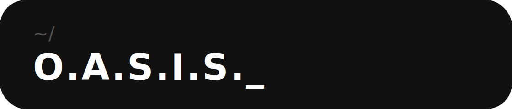

<div align="center">



### Offline AI System for Information Sovereignty

**Your AI assistant. Your PC. Your rules.**

Local · Private · Offline · No subscriptions

<br>

[](https://github.com/OASIS-AI/oasis/releases/latest)
[](https://discord.gg/88yfW5UwGC)
[](#)
[](#)

<br>

> *Everything ChatGPT promises — without sending a single byte outside your PC.*

<br>

</div>

---

## What is O.A.S.I.S.?

O.A.S.I.S. is a **local AI assistant for Windows** that runs entirely on your machine. No cloud. No subscriptions. No one reading your conversations.

It doesn't just chat — it **acts**. It opens apps, automates tasks, controls your desktop, reads your screen, manages your files and executes workflows while you focus on what matters. All powered by the best open-source AI models running directly on your hardware.

Think of it as having a capable, private copilot living inside your PC — one that gets smarter the more you use it, remembers everything you tell it, and never shares your data with anyone.

<br>

<div align="center">

</div>

<br>

---

## Why O.A.S.I.S. instead of ChatGPT or Copilot?

| | ChatGPT / Copilot | **O.A.S.I.S.** |
|---|---|---|
| Your conversations | Sent to servers | Stay on your PC |
| Your documents | Uploaded to the cloud | Never leave your machine |
| Monthly cost | $20/month forever | One-time payment |
| Works offline | ❌ | ✅ |
| Controls your PC | ❌ | ✅ |
| Remembers you | Limited | Grows with you |
| Your data, your rules | ❌ | ✅ |

<br>

---

## What O.A.S.I.S. can do

### 🧠 Actually understands you
Persistent memory that grows over time. O.A.S.I.S. remembers your projects, your preferences, your style — and uses that context in every response. Not just within a session. Forever.

### 🖥️ Controls your PC
Ask it to open VS Code, run a script, search GitHub, draft an email, move files or fill out a form. O.A.S.I.S. acts on your system directly — no copy-pasting required.

### ⚡ Automates your work
Build workflows that run automatically — triggered by time, events, voice or a keyboard shortcut. Chain multiple steps together. Let O.A.S.I.S. handle the repetitive parts of your day.

### 🎙️ Speaks and listens
Full voice mode with local speech recognition (Whisper) and high-quality local text-to-speech (Kokoro TTS). Hands-free, offline, with no audio sent anywhere.

### 📂 Understands your documents
Drop your PDFs, Word files, notes and code — O.A.S.I.S. reads, understands and answers questions about them. Your personal knowledge base, entirely local.

### 🔧 Runs Skills
Specialized modules that make O.A.S.I.S. an expert in specific tasks — coding assistant, writing assistant, data analyst, meeting summarizer, document generator and more. Install from the community library or build your own.

### 📄 Creates documents
Generate fully formatted PowerPoint presentations and Word documents from a single instruction. With your data, your style and your colors — no templates that look like everyone else's.

### 🔒 100% private by default
No telemetry. No cloud sync. No account required to use it. Your conversations, your files and your memory stay on your machine. Always.

<br>

---

## Built for real use

<div align="center">

```
"Summarize the PDF I just downloaded and draft a follow-up email"

"Every Monday at 9am, prepare my weekly briefing"

"Open VS Code, run the tests and tell me what failed"

"Create a 10-slide presentation about Q3 results for the board meeting tomorrow"

"What was that thing I was reading about React hooks last week?"
```

</div>

<br>

---

## Getting started

### System requirements

> ⚠️ Full requirements will be published with the stable release. Beta testers have reported smooth performance on mid-range gaming PCs and modern laptops with dedicated GPUs.

Minimum recommended:
- **OS:** Windows 10 / 11 (64-bit)
- **RAM:** 16 GB
- **Storage:** 20 GB free space
- **GPU:** Dedicated GPU recommended for best performance (NVIDIA or AMD)
- **CPU:** Works on CPU-only setups with smaller models

<br>

### Installation

**1. Download the installer**

Go to the [**Releases**](https://github.com/OASIS-AI/oasis/releases/latest) page and download `OASIS_Setup.exe`

**2. Run the installer**

The installer checks your system requirements, downloads the AI model and sets everything up automatically. No terminal. No configuration files.

**3. Complete the onboarding**

O.A.S.I.S. walks you through a guided setup — choose your privacy settings, configure your microphone, pick your AI model and personalize your assistant. Takes about 5 minutes.

**4. You're ready**

Press `Ctrl + Shift + Space` from anywhere on your PC to bring O.A.S.I.S. up instantly.

<br>

---

## Plans

O.A.S.I.S. launches as a **free version** — no payment, no account, no strings attached. Download it, use it, and see what a local AI assistant can actually do.

Paid plans with expanded capabilities are coming. Early community members will get priority access and the best pricing — it won't get cheaper than it is at launch.

> Join the [Discord](https://discord.gg/88yfW5UwGC) to stay updated on when paid plans go live.

<br>

---

## Keyboard shortcuts

| Shortcut | Action |
|---|---|
| `Ctrl + Shift + Space` | Open O.A.S.I.S. from anywhere |
| `Ctrl + Shift + V` | Activate voice mode |
| `Ctrl + N` | New conversation |
| `Ctrl + K` | Command palette |
| `Ctrl + Shift + S` | Screenshot + analyze |

<br>

---

## Roadmap

O.A.S.I.S. is in active development. Here's what's coming:

- [x] Core chat with local models
- [x] Voice mode (STT + TTS)
- [x] App control and automation
- [x] Skills and Workflows system
- [x] Cloud model support (optional)
- [x] Automatic updates with rollback
- [x] RAG over personal documents
- [x] Real-time screen context stream
- [ ] Mobile companion app
- [ ] Room microphone network (NEXUS)
- [ ] Voice cloning (NEXUS)
- [ ] Meeting transcription (NEXUS)
- [ ] Document and presentation generator
- [ ] Community skills library
- [ ] macOS support

<br>

---

## Privacy — the real kind

Most "private" AI tools still send your data somewhere. O.A.S.I.S. doesn't.

- **No account required** to use the app
- **No telemetry** by default — optional and anonymous if you choose to enable it
- **No cloud processing** — every AI response is generated on your hardware
- **No training on your data** — your conversations are yours
- **Offline first** — works with no internet connection at all
- **Auditable** — when Privacy Mode is on, O.A.S.I.S. shows you in real time that no network connections are active

Your data never leaves your PC. This isn't a policy — it's the architecture.

<br>

---

## Join the community

O.A.S.I.S. is being built in the open, and the community shapes what gets built next.

<div align="center">

[](https://discord.gg/88yfW5UwGC)

</div>

The Discord server is organized so you can jump straight to what you need:

**📢 info**
- **#about-oasis** — what the project is, why it exists and where it's going
- **#rules** — community guidelines
- **#announcements** — releases, betas and major updates
- **#roadmap** — what's being built and in what order
- **#links** — useful resources, docs and external references

**💬 O.A.S.I.S.**
- **#general** — talk to the developer and other users
- **#showcase** — show what you're building or doing with O.A.S.I.S.
- **#suggestions** — propose features and vote on what gets built next
- **#beta** — early access releases and beta builds *(requires Beta Tester role — see below)*

**🔧 dev | support**
- **#documentation** — guides and references *(read-only)*
- **#bugs** — report issues with context and steps to reproduce *(moderated)*
- **#dev-chat** — development discussion *(private — contributors only)*
- **#code-helpers-chat** — technical help for contributors *(private — contributors only)*

<br>

> **Want beta access?**
> The `#beta` channel is restricted to users with the **Beta Tester** role. To get it, get involved — share feedback in `#general`, report bugs or contribute to discussions. Beta access is given to people who are genuinely interested in helping shape the product, not just downloading early builds.

<br>

---

## Frequently asked questions

**Does it work without internet?**
Yes. Once installed, O.A.S.I.S. runs entirely offline. The only features that require internet are optional cloud model integrations, which you can ignore completely.

**Do I need a powerful PC?**
A dedicated GPU gives the best experience, but O.A.S.I.S. also runs on CPU-only setups with smaller, optimized models. Full hardware requirements will be published with the stable release.

**What AI models does it use?**
O.A.S.I.S. uses Gemma 4 locally by default and supports any GGUF-compatible model — Llama 3, Mistral, Phi-3, CodeLlama and many more. You choose the model based on your hardware and needs. Optional cloud providers (OpenAI, Anthropic, Google) are available if you prefer.

**Is my data really private?**
Your conversations, documents and memory never leave your PC. There are no user accounts, no cloud sync and no data collection unless you explicitly opt into anonymous crash reporting.

**Is it really free?**
Yes. The initial release is completely free. Paid plans with additional features are coming — join the Discord to know when they launch and get early access pricing.

**What paid plans are coming?**
Details will be announced in the Discord before launch. Early community members get priority access and the best price — it won't get cheaper after launch.

**Will it work on macOS or Linux?**
Windows only for now. macOS and Linux are on the roadmap.

**How do I get beta access?**
Join the [Discord](https://discord.gg/88yfW5UwGC) and get involved. Beta access is given to active community members who participate in discussions, report bugs or share feedback — not handed out automatically.

**I found a bug. Where do I report it?**
Open an [Issue](https://github.com/OASIS-AI/oasis/issues) on GitHub or post in **#bugs** on Discord. Please include your system specs and steps to reproduce.

<br>

---

## A note from the developer

O.A.S.I.S. is an independent project built by a single developer with one goal: to give people a genuinely capable AI assistant that respects their privacy completely.

This isn't a startup with investor pressure to monetize your data. It's a tool built because the right version of it didn't exist yet.

Every conversation you have stays on your machine. Every file you share stays local. Every response is generated on your hardware. That's not a marketing claim — it's how the code works.

If you believe your conversations should stay yours, O.A.S.I.S. was built for you.

— The developer

<br>

---

<div align="center">

**O.A.S.I.S.** · Operative Autonomous System for Intelligent Services

[Download](https://github.com/OASIS-AI/oasis/releases/latest) · [Discord](https://discord.gg/88yfW5UwGC) · [Report a bug](https://github.com/OASIS-AI/oasis/issues)

<br>

*Built for people who believe their data belongs to them.*

</div>
