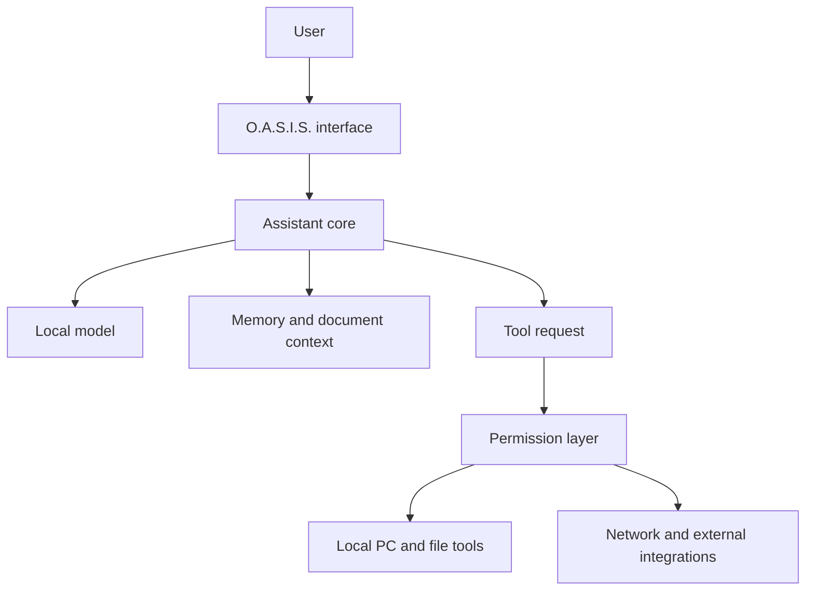

# O.A.S.I.S.

### Offline AI System for Information Sovereignty

**The AI assistant that lives on your PC.**

Local-first · Tool-enabled · Privacy-conscious · No account required for Personal

[](https://oasislocal.github.io/O.A.S.I.S./) [](https://github.com/OASISLocal/O.A.S.I.S./releases) [](https://discord.gg/88yfW5UwGC)

**Public beta · v0.2.0 · Windows 10/11 x64**

> [!IMPORTANT]
> O.A.S.I.S. is proprietary software. This public repository provides releases, documentation, issue tracking and project transparency; the application source code is not public.

## What is O.A.S.I.S.?

O.A.S.I.S. is a Windows AI assistant built around local models, your files and explicit tool permissions. It is designed to help with useful computer work—not only answer questions.

You can use it to:

- chat with compatible local GGUF models;
- search, read and summarize files and documents;
- keep manageable local memory between conversations;
- use voice input and spoken responses;
- inspect supported PC information and perform everyday low-risk actions;
- automate simple routines and workflows;
- use network-enabled features only when you choose or configure them.

O.A.S.I.S. is **offline-first, not network-blind**. Local features can run on your PC after the required models are downloaded; web search, external services and integrations require connectivity.

## Why local-first?

Local processing can provide more control over sensitive context, model choice and ongoing costs. It also makes the hardware trade-off explicit: you own the machine that runs the model.

No architecture can guarantee that every AI response is correct or that every feature is offline. O.A.S.I.S. surfaces tool activity, permissions and results so important actions can be inspected.

## How it works


```mermaid
flowchart TD
    U[User] --> I[O.A.S.I.S. interface]
    I --> C[Assistant core]
    C --> M[Local model]
    C --> R[Memory and document context]
    C --> T[Tool request]
    T --> P[Permission layer]
    P --> L[Local PC and file tools]
    P --> X[Network and external integrations]
```

The model proposes a tool request. The permission layer decides whether that request can run. The tool performs the operation and returns a result to the assistant.

## Capabilities

| Area | Personal | Max / planned availability |
| --- | --- | --- |
| Local chat and model management | Included | Included |
| Local voice input and output | Included | Included |
| Memory and documents | Included | Advanced capabilities planned |
| Everyday PC control | Included | Included |
| Vision and screen analysis | Planned for Max | Max |
| Coding agent and sandbox | Basic assistance | Max |
| Scheduled and conditional workflows | Simple routines | Max |
| Browser, mobile and messaging integrations | — | Max |
| MCP and external tool servers | — | Max |

Availability can change during beta. Check the website and release notes for the current build.

### Files and documents

Search local files, read supported documents, extract information, calculate values and return source context. Example: “Find my Q2 electricity bills and calculate the total.”

### Memory

Local memory can retain facts, notes, conversation context and supported document information. Stored items can be searched, reviewed and removed.

### Voice

The beta supports voice input and spoken responses in Spanish and English. Wake-word and interruptible conversation features depend on the current build and configuration.

### PC control

Supported tools can inspect system information, open applications, control windows and media, manage volume, use clipboard functions and perform other everyday actions. Higher-impact operations can require explicit approval.

### Vision, coding and workflows

Vision, advanced coding, isolated code execution, scheduled workflows and integrations are Max capabilities or planned availability. Do not assume every feature is enabled in every edition.

## Tools and permissions

The current public product register contains **101 tool calls**, including **5 conditional calls**, and the public product figure is **100+ tools**.

| Family | Examples |
| --- | --- |
| Files | Search, copy, move, rename, inspect |
| Documents | PDF and document extraction, references |
| System | CPU, RAM, disk, network and Wi-Fi status |
| PC control | Applications, windows, volume and media |
| Memory | Facts, notes, conversations and documents |
| Productivity | Timers, reminders, notes and calendars |
| Coding | Repository assistance, diffs and sandbox workflows |
| Network | Web search and configured external services |

Tools are not unrestricted administrator access. Permissions are configurable per tool, and sensitive actions may require confirmation.

| Risk example | Typical control |
| --- | --- |
| Calculator or system information | Automatic |
| Open an application or move a file | Configurable permission |
| Delete files, restart or shut down | Explicit approval |
| Execute generated code | Sandbox and/or approval |

## Local AI and models

O.A.S.I.S. uses compatible local **GGUF** models. Current profiles:

| Profile | Intended direction |
| --- | --- |
| `gemma-4b-it` | General local assistant |
| `qwen-2.5-1.5b` | Smaller and lighter hardware |
| `llama-3.2-3b` | General-purpose local use |

Other GGUF models may work, but compatibility depends on the exact model, quantization, context size, backend and O.A.S.I.S. version. No individual model should be assumed compatible without testing.

## Hardware and platform

| Requirement | Guidance |
| --- | --- |
| Operating system | Windows 10 or Windows 11, x64 |
| CPU | Modern CPU; smaller models are more practical on CPU-only systems |
| RAM | Depends on model size and context length |
| GPU | Optional; NVIDIA GPU recommended for faster inference |
| Storage | Application plus downloaded model files |
| Docker | Required only for supported code-sandbox workflows |

## Installation

1. Download the latest Windows release from [GitHub Releases](https://github.com/OASISLocal/O.A.S.I.S./releases).
2. Run the installer.
3. Open **Models** and download a profile suited to your hardware.
4. Start a chat or enable voice mode.

Useful first prompts:

```text
Find the PDF I downloaded yesterday and summarize it.
What's using the most RAM right now?
Explain this code error.
Remind me tomorrow at 9.
```

## Editions

### Personal

The current Personal edition is free and does not require an account. It focuses on local chat, voice, basic memory and documents, everyday PC control, simple routines and local backups.

### Max

Max is the expanded edition for advanced coding, vision, sandbox workflows, scheduled workflows, messaging, browser/mobile companions, MCP integrations and other capabilities as they become available. Availability and terms are published on the [website](https://oasislocal.github.io/O.A.S.I.S./).

## Privacy and network behavior

| Operation | Expected behavior |
| --- | --- |
| Local chat, files, memory and local models | Can remain on your PC |
| Voice and screen features | Local processing where supported; permissions apply |
| Web search and online pages | Requires network access |
| External services and tool servers | Requires network access and configuration |
| Core local experience | No mandatory cloud backend or account |

Read the full [privacy page](https://oasislocal.github.io/O.A.S.I.S./privacy.html) before using sensitive integrations.

## Roadmap

- [x] Local chat, GGUF model management, voice and memory
- [x] Documents, everyday PC tools and tool permissions
- [x] Simple routines and local backups
- [ ] Max early access and expanded coding workflows
- [ ] Linux and macOS builds
- [ ] Plugin and marketplace foundations
- [ ] Multi-agent workflows and additional local runtimes

The roadmap is directional, not a promise. Follow [releases](https://github.com/OASISLocal/O.A.S.I.S./releases) and the [changelog](https://oasislocal.github.io/O.A.S.I.S./changelog.html) for shipped work.

## Beta status and bug reports

The current release is **O.A.S.I.S. v0.2.0 beta**. Expect changes to the interface, tools, model support, permissions and hardware compatibility.

For reproducible issues, open a [GitHub Issue](https://github.com/OASISLocal/O.A.S.I.S./issues) and include:

- O.A.S.I.S. version and Windows version;
- CPU, GPU and RAM;
- model and quantization;
- expected and actual behavior;
- steps to reproduce;
- relevant logs, without private data.

## FAQ

<details>
<summary>Does O.A.S.I.S. work without the internet?</summary>

Yes, for supported local functionality after a local model is downloaded. Web search, online pages, external services and integrations need connectivity.
</details>

<details>
<summary>Does it require an account?</summary>

No account is required for the current Personal experience.
</details>

<details>
<summary>Can I use my own model?</summary>

Compatible GGUF models can be tested, but exact compatibility depends on the model and runtime configuration.
</details>

<details>
<summary>Can it run without a GPU?</summary>

Yes. A dedicated GPU is optional, though it can improve local inference speed.
</details>

<details>
<summary>Does it continuously access my screen?</summary>

Screen access is permission-controlled and intended for requested workflows, not as an assumption of continuous access.
</details>

## Community and contribution

- [Discord community](https://discord.gg/88yfW5UwGC)
- [Documentation](https://github.com/OASISLocal/O.A.S.I.S./tree/main/docs)
- [GitHub Discussions](https://github.com/OASISLocal/O.A.S.I.S./discussions)
- [Issues](https://github.com/OASISLocal/O.A.S.I.S./issues)

The public repository is useful for documentation improvements, testing feedback and reproducible issue reports. Before proposing a large change, search existing issues and keep contributions focused.

## Resources

| Resource | Link |
| --- | --- |
| Website | [oasislocal.github.io/O.A.S.I.S.](https://oasislocal.github.io/O.A.S.I.S./) |
| Releases | [GitHub Releases](https://github.com/OASISLocal/O.A.S.I.S./releases) |
| Changelog | [Product changelog](https://oasislocal.github.io/O.A.S.I.S./changelog.html) |
| Privacy | [Privacy page](https://oasislocal.github.io/O.A.S.I.S./privacy.html) |
| Community | [Discord](https://discord.gg/88yfW5UwGC) |

## License and transparency

O.A.S.I.S. is proprietary software. See the repository’s license and release terms for the rights that apply to downloads and documentation.

<div align="center">**Your AI. Your PC. Your rules.**</div>
